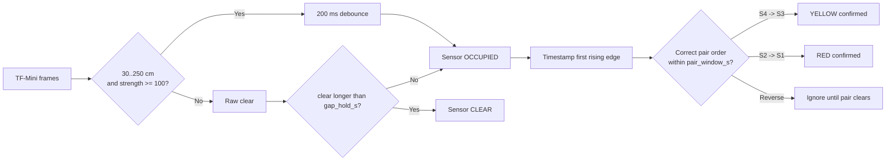
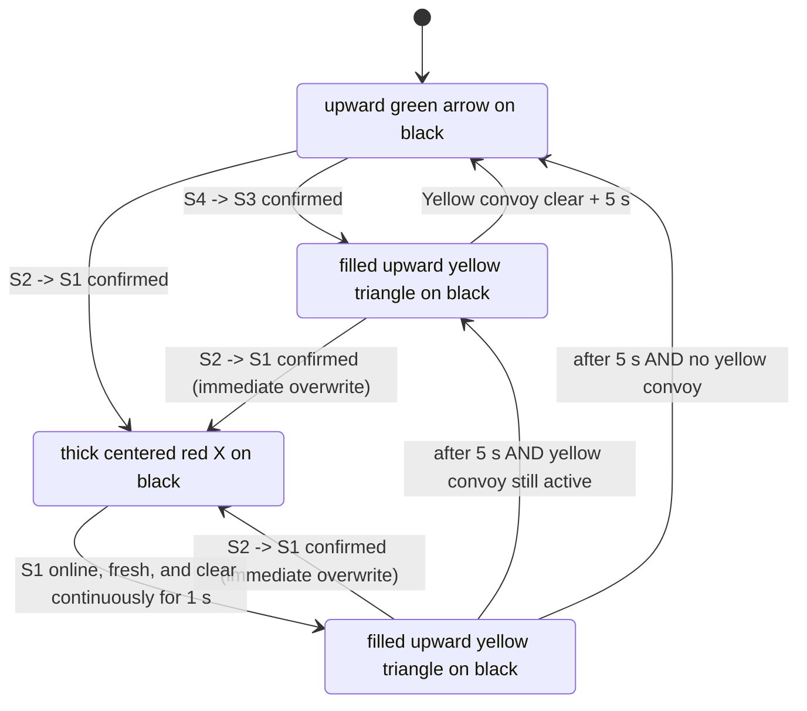

# Traffic Light Logic — Normal Junction V1

[Historical logic illustration](logic_diagram.png) — its display artwork is superseded by the symbol rules below.

## Purpose
This controller protects an E-Car junction using four downward TF-Mini Plus sensors. One E-Car may contain a cab/body, gaps, and multiple dollies, so a vehicle is **not** assumed to be one continuous solid object.

## Sensor positions and direction

```text
Junction                                                     STOP side
    <---- S1 ----1 m---- S2 ----------- S3 ----1 m---- S4 ---- travel
             Red pair                         Yellow pair

Valid travel direction: S4 -> S3 -> S2 -> S1
Yellow trigger: S4 -> S3 within 5 s
Red trigger: S2 -> S1 within 5 s
Red release: S1 must be online, fresh, and clear for 1 s before RETURN
Reverse direction: S3 -> S4 or S1 -> S2 is ignored
```

## Three-layer detection

1. **Raw frame** — valid TF-Mini frame, distance `30..250 cm`, strength `>= 100`.
2. **Sensor occupancy** — raw detect must pass 200 ms debounce. Short gaps up to `gap_hold_s` stay occupied, so cab/body/dolly gaps remain one convoy.
3. **Directional pair** — first sensor rising edge followed by second sensor rising edge within `pair_window_s` confirms direction.



## Main state machine



`red_duration_s` remains in config as a legacy/reference value. RED exit is controlled by direct S1 occupancy plus `red_clear_delay_s`, and release requires S1 data fresher than `red_exit_sensor_fresh_timeout_s`. With `red_exit_sensor_fresh_timeout_s=0.5`, S1 must be online with a valid frame aged 0–0.5 s and continuously clear for `red_clear_delay_s=1.0`. Occupied, offline, stale, missing, or future-dated data resets the clear timer and holds RED. A new valid red pair globally preempts IDLE, YELLOW, and RETURN; while already RED it resets the clear timer.

Known residual risk: a service restart while a vehicle is already on S1 may not reconstruct RED without a new S2 -> S1 pair. This behavior is unchanged.

## E-Car + dolly waveform

```text
One convoy passing one sensor:

Cab        operator gap      rear body      hitch    dolly #1   hitch   dolly #2
█████████ _____ ███████████ ______ █████████ _____ ███████ _____ ███████
 detect    gap      detect           detect          detect       detect

Short gaps are absorbed by gap_hold_s, therefore this is treated as ONE convoy.
```

## Two E-Cars following each other

- If the inter-vehicle clear gap is shorter than `gap_hold_s`, they are intentionally treated as one convoy. This is safe for traffic-light operation.
- If the clear gap exceeds `gap_hold_s`, the first convoy closes and the next rising edge starts a new vehicle event.
- The system is not intended to count vehicles precisely; it is intended to keep the junction indication safe and stable.

## Fault behavior

A sensor with no valid frame for `offline_timeout_s=2.0` is marked offline. The Pi continues its traffic logic and publishes fault details such as `ERR:S2`. Recovery requires valid frames continuously for `recover_stable_s=1.0`.

The symbol display retains explicit RED/STOP during faults; other faulted states render a yellow triangle. MQTT disconnection or no command for more than 5 seconds produces effective `LINK ERR`. Symbol mode does not draw fault text; maintenance uses diagnostics.


## Final HUB75 display behavior

Current field displays are D1–D3; software retains support for IDs 1–7. The Pi alone detects pairs and controls traffic timing. Healthy connected displays render the same MQTT state.

| State | Symbol | Background |
|---|---|---|
| IDLE | Upward green arrow | Black |
| YELLOW | Filled upward yellow triangle | Black |
| RED | Thick centered red X | Black |
| RETURN | Filled upward yellow triangle | Black |

Selection precedence: explicit `red` color or `STOP` text → red X; explicit `yellow` or `CAUTION` → yellow triangle; effective fault / `LINK ERR` → yellow triangle; explicit `green` or `GO` → green arrow; otherwise → yellow triangle. Missing or incorrectly typed text/color fields default to empty, never green.

Canonical project: `C:\TPCAP_TRAFFIC_LIGHT\AutoEcar_git\esp32_display`. Production environments are `display1_symbols`, `display2_symbols`, and `display3_symbols`; bench mode is disabled.
