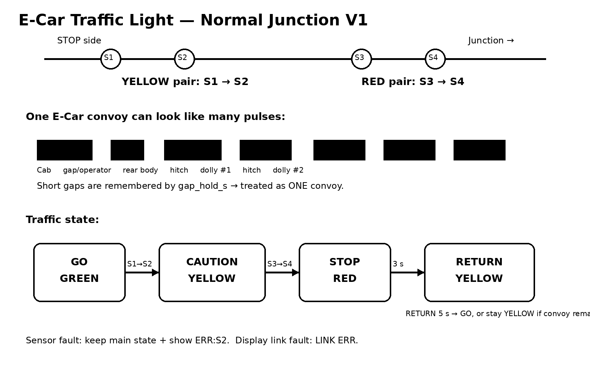
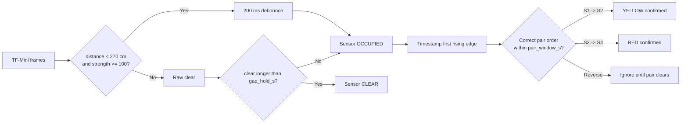
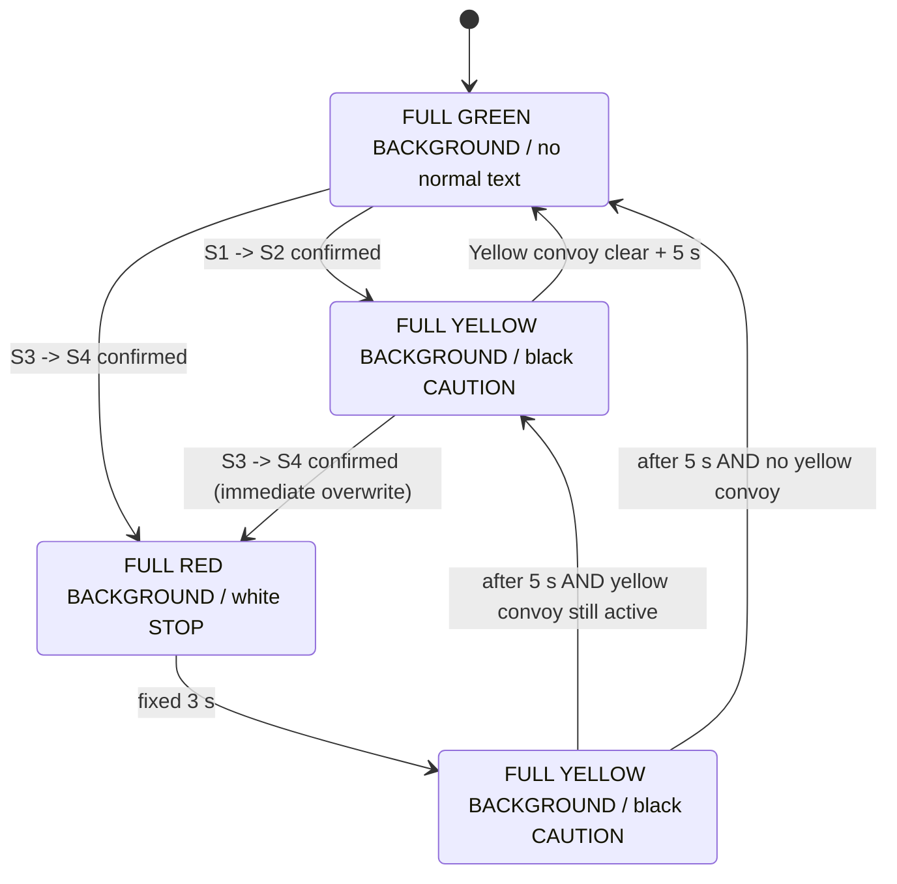

# Traffic Light Logic — Normal Junction V1



## Purpose
This controller protects an E-Car junction using four downward TF-Mini Plus sensors. One E-Car may contain a cab/body, gaps, and multiple dollies, so a vehicle is **not** assumed to be one continuous solid object.

## Sensor positions and direction

```text
STOP side                                                     Junction
   |---- S1 ----1 m---- S2 ----------- S3 ----1 m---- S4 --------> travel
          Yellow pair                       Red pair

Valid direction: S1 -> S2, then later S3 -> S4
Reverse direction: S2 -> S1 or S4 -> S3 is ignored
```

## Three-layer detection

1. **Raw frame** — valid TF-Mini frame, distance `< 270 cm`, strength `>= 100`.
2. **Sensor occupancy** — raw detect must pass 200 ms debounce. Short gaps up to `gap_hold_s` stay occupied, so cab/body/dolly gaps remain one convoy.
3. **Directional pair** — first sensor rising edge followed by second sensor rising edge within `pair_window_s` confirms direction.



## Main state machine



## E-Car + dolly waveform

```text
One convoy passing one sensor:

Cab        operator gap      rear body      hitch    dolly #1   hitch   dolly #2
█████████ _____ ███████████ ______ █████████ _____ ███████ _____ ███████
 detect    gap      detect           detect          detect       detect

Short gaps are absorbed by gap_hold_s, therefore this is treated as ONE convoy.
```

## Two E-Cars following each other

- If the inter-vehicle clear gap is shorter than `gap_hold_s`, they are intentionally treated as one convoy. This is safe for traffic-light operation.
- If the clear gap exceeds `gap_hold_s`, the first convoy closes and the next rising edge starts a new vehicle event.
- The system is not intended to count vehicles precisely; it is intended to keep the junction indication safe and stable.

## Fault behavior

A sensor with no valid frame for `offline_timeout_s` is marked offline. The controller does **not** force the whole junction red. Every display keeps the current traffic state and shows a small corner/bottom warning such as:

```text
GO
ERR:S2
```

When the sensor produces valid frames continuously for `recover_stable_s`, the warning clears automatically.

If display Ethernet/MQTT is lost, that display keeps its last traffic state and adds `LINK ERR` after 5 seconds.


## Final HUB75 display behavior

All 64x32 displays are independent panels but always show the **same junction state at the same time**.

| State | Full-screen background | Main text | Text color |
|---|---|---|---|
| IDLE | Green | none | — |
| YELLOW | Yellow | `CAUTION` | Black |
| RED | Red | `STOP` | White |
| RETURN | Yellow | `CAUTION` | Black |

The full background color is intentional so the driver can recognize the state from a long distance. Sensor or link faults are shown only as a small black corner/bottom badge (for example `ERR:S2` or `LINK ERR`) and do not replace the main traffic color.
