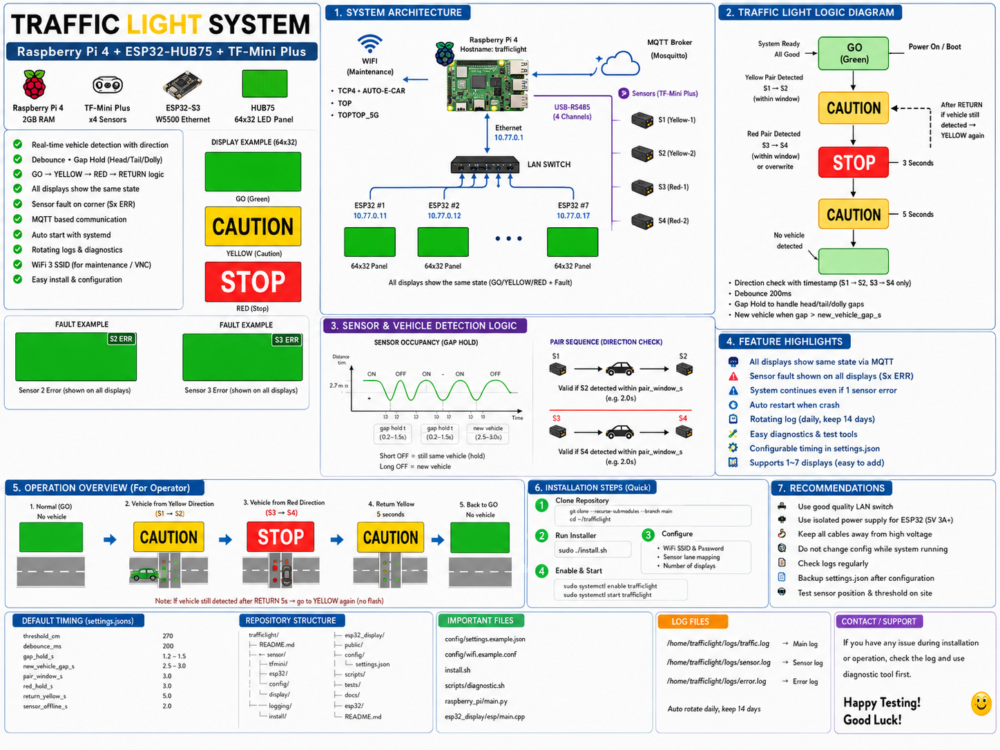

# Operator Guide — E-Car Traffic Light



## What the display means

| Display | Meaning | Operator action |
|---|---|---|
| GREEN / `GO` | Junction available | Proceed normally and remain aware of cross traffic |
| YELLOW / `CAUTION` | E-Car convoy is approaching / leaving protected zone | Slow down and prepare to stop |
| RED / `STOP` | E-Car is at the junction red zone | Stop and wait |
| `ERR:S1` / `ERR:S2` / etc. | A sensor has a communication fault | Traffic light continues operating with remaining logic; report/check the named sensor |
| `LINK ERR` | This display lost communication with controller | Treat display as unreliable and report immediately |

## Important
- All displays belonging to the same junction show the same traffic color/state at the same time.
- The E-Car may tow dollies. Short empty spaces between cab, body, hitch, and dollies are normal and are remembered by the controller.
- Do not use the small fault text as a traffic command. The large color/state remains the traffic command.

## Sensor names

```text
Travel direction ->
S1 ---- S2 ---------------- S3 ---- S4 ---- Junction
Yellow pair                  Red pair
```

## If something looks wrong
1. Do not open the control box while energized unless authorized.
2. Note the fault shown (`S1`, `S2`, `S3`, `S4`, or `LINK ERR`).
3. Inform maintenance/engineering.
4. If traffic behavior is visibly unsafe or inconsistent, stop using the junction and follow site safety procedure.


## สิ่งที่ผู้ขับจะเห็นบนจอ (Final)

- **สีเขียว:** พื้นจอเขียวเต็มจอ ไม่มีข้อความปกติ
- **สีเหลือง:** พื้นจอเหลืองเต็มจอ + `CAUTION` สีดำ
- **สีแดง:** พื้นจอแดงเต็มจอ + `STOP` สีขาว
- ทุกจอของแยกแสดงเหมือนกันและเปลี่ยนพร้อมกัน
- ถ้า Sensor เสีย จะมีข้อความเล็กมุมจอ เช่น `ERR:S2` แต่สีหลักของจอยังทำงานตาม Traffic Logic
- ถ้าจอขาดการติดต่อกับ Pi/MQTT จะแสดง `LINK ERR` เป็นข้อความเล็ก โดยยังคงสี State ล่าสุด
